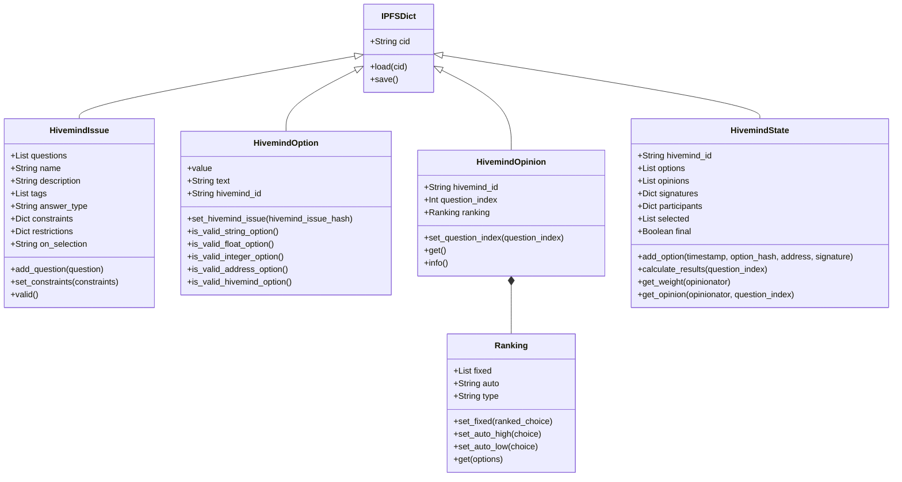

```mermaid
classDiagram
    class IPFSDict {
        +String cid
        +load(cid)
        +save()
    }
    
    class HivemindIssue {
        +List questions
        +String name
        +String description
        +List tags
        +String answer_type
        +Dict constraints
        +Dict restrictions
        +String on_selection
        +add_question(question)
        +set_constraints(constraints)
        +valid()
    }
    
    class HivemindOption {
        +value
        +String text
        +String hivemind_id
        +set_hivemind_issue(hivemind_issue_hash)
        +is_valid_string_option()
        +is_valid_float_option()
        +is_valid_integer_option()
        +is_valid_address_option()
        +is_valid_hivemind_option()
    }
    
    class HivemindOpinion {
        +String hivemind_id
        +Int question_index
        +Ranking ranking
        +set_question_index(question_index)
        +get()
        +info()
    }
    
    class Ranking {
        +List fixed
        +String auto
        +String type
        +set_fixed(ranked_choice)
        +set_auto_high(choice)
        +set_auto_low(choice)
        +get(options)
    }
    
    class HivemindState {
        +String hivemind_id
        +List options
        +List opinions
        +Dict signatures
        +Dict participants
        +List selected
        +Boolean final
        +add_option(timestamp, option_hash, address, signature)
        +calculate_results(question_index)
        +get_weight(opinionator)
        +get_opinion(opinionator, question_index)
    }
    
    IPFSDict <|-- HivemindIssue
    IPFSDict <|-- HivemindOption
    IPFSDict <|-- HivemindOpinion
    IPFSDict <|-- HivemindState
    HivemindOpinion *-- Ranking
```
