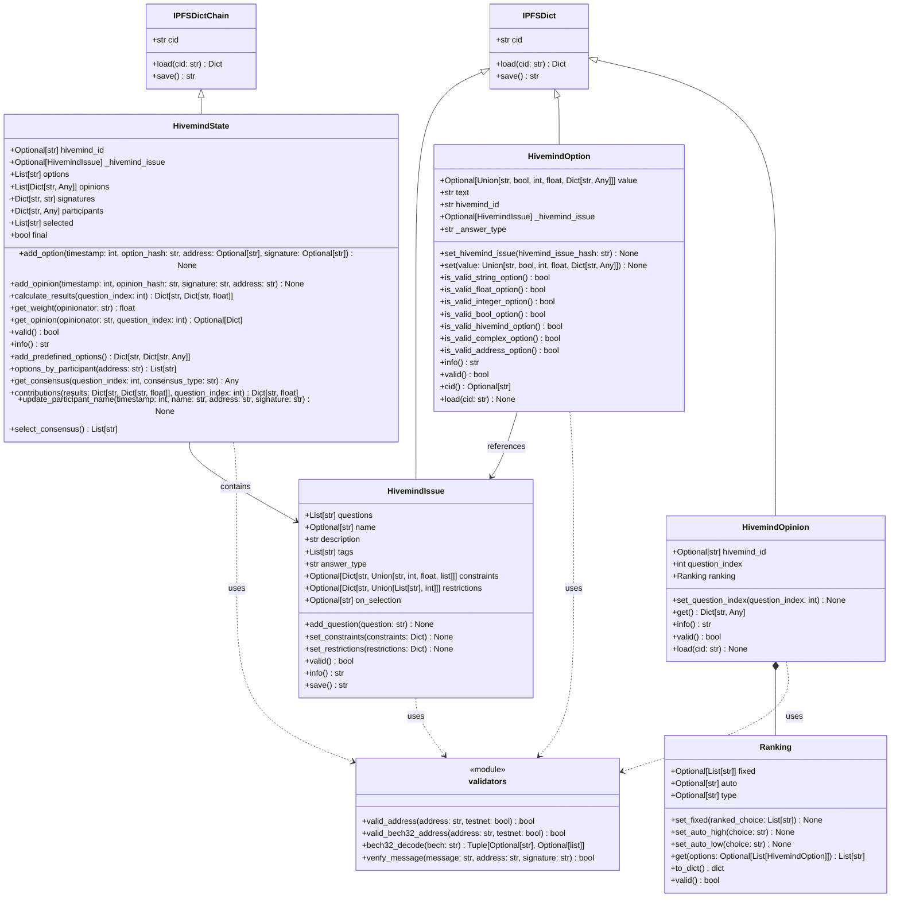

```mermaid
classDiagram
    class IPFSDict {
        +str cid
        +load(cid: str) Dict
        +save() str
    }
    
    class IPFSDictChain {
        +str cid
        +load(cid: str) Dict
        +save() str
    }
    
    class HivemindIssue {
        +List[str] questions
        +Optional[str] name
        +str description
        +List[str] tags
        +str answer_type
        +Optional[Dict[str, Union[str, int, float, list]]] constraints
        +Optional[Dict[str, Union[List[str], int]]] restrictions
        +Optional[str] on_selection
        +add_question(question: str) None
        +set_constraints(constraints: Dict) None
        +set_restrictions(restrictions: Dict) None
        +valid() bool
        +info() str
        +save() str
    }
    
    class HivemindOption {
        +Optional[Union[str, bool, int, float, Dict[str, Any]]] value
        +str text
        +str hivemind_id
        +Optional[HivemindIssue] _hivemind_issue
        +str _answer_type
        +set_hivemind_issue(hivemind_issue_hash: str) None
        +set(value: Union[str, bool, int, float, Dict[str, Any]]) None
        +is_valid_string_option() bool
        +is_valid_float_option() bool
        +is_valid_integer_option() bool
        +is_valid_bool_option() bool
        +is_valid_hivemind_option() bool
        +is_valid_complex_option() bool
        +is_valid_address_option() bool
        +info() str
        +valid() bool
        +cid() Optional[str]
        +load(cid: str) None
    }
    
    class HivemindOpinion {
        +Optional[str] hivemind_id
        +int question_index
        +Ranking ranking
        +set_question_index(question_index: int) None
        +get() Dict[str, Any]
        +info() str
        +valid() bool
        +load(cid: str) None
    }
    
    class Ranking {
        +Optional[List[str]] fixed
        +Optional[str] auto
        +Optional[str] type
        +set_fixed(ranked_choice: List[str]) None
        +set_auto_high(choice: str) None
        +set_auto_low(choice: str) None
        +get(options: Optional[List[HivemindOption]]) List[str]
        +to_dict() dict
        +valid() bool
    }
    
    class HivemindState {
        +Optional[str] hivemind_id
        +Optional[HivemindIssue] _hivemind_issue
        +List[str] options
        +List[Dict[str, Any]] opinions
        +Dict[str, str] signatures
        +Dict[str, Any] participants
        +List[str] selected
        +bool final
        +add_option(timestamp: int, option_hash: str, address: Optional[str], signature: Optional[str]) None
        +add_opinion(timestamp: int, opinion_hash: str, signature: str, address: str) None
        +calculate_results(question_index: int) Dict[str, Dict[str, float]]
        +get_weight(opinionator: str) float
        +get_opinion(opinionator: str, question_index: int) Optional[Dict]
        +valid() bool
        +info() str
        +add_predefined_options() Dict[str, Dict[str, Any]]
        +options_by_participant(address: str) List[str]
        +get_consensus(question_index: int, consensus_type: str) Any
        +contributions(results: Dict[str, Dict[str, float]], question_index: int) Dict[str, float]
        +update_participant_name(timestamp: int, name: str, address: str, signature: str) None
        +select_consensus() List[str]
    }

    class validators {
        <<module>>
        +valid_address(address: str, testnet: bool) bool
        +valid_bech32_address(address: str, testnet: bool) bool
        +bech32_decode(bech: str) Tuple[Optional[str], Optional[list]]
        +verify_message(message: str, address: str, signature: str) bool
    }
    
    IPFSDict <|-- HivemindIssue
    IPFSDict <|-- HivemindOption
    IPFSDict <|-- HivemindOpinion
    IPFSDictChain <|-- HivemindState
    HivemindOpinion *-- Ranking
    HivemindOption --> HivemindIssue : references
    HivemindState --> HivemindIssue : contains
    HivemindState ..> validators : uses
    HivemindOption ..> validators : uses
    HivemindOpinion ..> validators : uses
    HivemindIssue ..> validators : uses
```