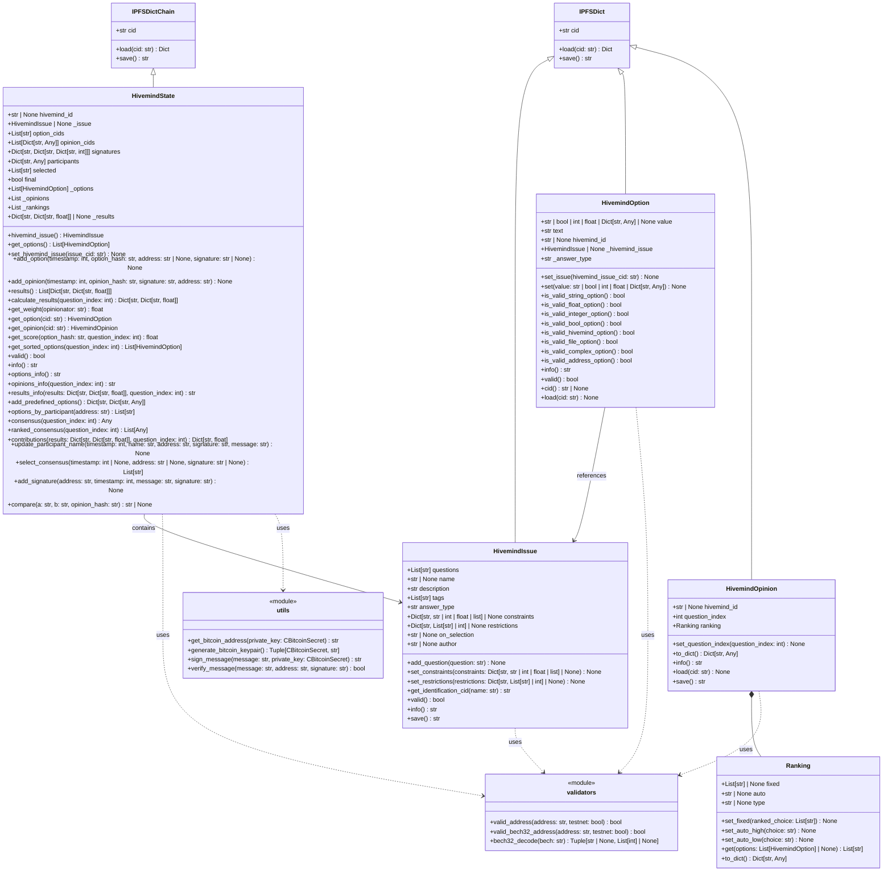

```mermaid
classDiagram
    class IPFSDict {
        +str cid
        +load(cid: str) Dict
        +save() str
    }
    
    class IPFSDictChain {
        +str cid
        +load(cid: str) Dict
        +save() str
    }
    
    class HivemindIssue {
        +List[str] questions
        +str | None name
        +str description
        +List[str] tags
        +str answer_type
        +Dict[str, str | int | float | list] | None constraints
        +Dict[str, List[str] | int] | None restrictions
        +str | None on_selection
        +str | None author
        +add_question(question: str) None
        +set_constraints(constraints: Dict[str, str | int | float | list] | None) None
        +set_restrictions(restrictions: Dict[str, List[str] | int] | None) None
        +get_identification_cid(name: str) str
        +valid() bool
        +info() str
        +save() str
    }
    
    class HivemindOption {
        +str | bool | int | float | Dict[str, Any] | None value
        +str text
        +str | None hivemind_id
        +HivemindIssue | None _hivemind_issue
        +str _answer_type
        +set_issue(hivemind_issue_cid: str) None
        +set(value: str | bool | int | float | Dict[str, Any]) None
        +is_valid_string_option() bool
        +is_valid_float_option() bool
        +is_valid_integer_option() bool
        +is_valid_bool_option() bool
        +is_valid_hivemind_option() bool
        +is_valid_file_option() bool
        +is_valid_complex_option() bool
        +is_valid_address_option() bool
        +info() str
        +valid() bool
        +cid() str | None
        +load(cid: str) None
    }
    
    class HivemindOpinion {
        +str | None hivemind_id
        +int question_index
        +Ranking ranking
        +set_question_index(question_index: int) None
        +to_dict() Dict[str, Any]
        +info() str
        +load(cid: str) None
        +save() str
    }
    
    class Ranking {
        +List[str] | None fixed
        +str | None auto
        +str | None type
        +set_fixed(ranked_choice: List[str]) None
        +set_auto_high(choice: str) None
        +set_auto_low(choice: str) None
        +get(options: List[HivemindOption] | None) List[str]
        +to_dict() Dict[str, Any]
    }
    
    class HivemindState {
        +str | None hivemind_id
        +HivemindIssue | None _issue
        +List[str] option_cids
        +List[Dict[str, Any]] opinion_cids
        +Dict[str, Dict[str, Dict[str, int]]] signatures
        +Dict[str, Any] participants
        +List[str] selected
        +bool final
        +List[HivemindOption] _options
        +List _opinions
        +List _rankings
        +Dict[str, Dict[str, float]] | None _results
        +hivemind_issue() HivemindIssue
        +get_options() List[HivemindOption]
        +set_hivemind_issue(issue_cid: str) None
        +add_option(timestamp: int, option_hash: str, address: str | None, signature: str | None) None
        +add_opinion(timestamp: int, opinion_hash: str, signature: str, address: str) None
        +results() List[Dict[str, Dict[str, float]]]
        +calculate_results(question_index: int) Dict[str, Dict[str, float]]
        +get_weight(opinionator: str) float
        +get_option(cid: str) HivemindOption
        +get_opinion(cid: str) HivemindOpinion
        +get_score(option_hash: str, question_index: int) float
        +get_sorted_options(question_index: int) List[HivemindOption]
        +valid() bool
        +info() str
        +options_info() str
        +opinions_info(question_index: int) str
        +results_info(results: Dict[str, Dict[str, float]], question_index: int) str
        +add_predefined_options() Dict[str, Dict[str, Any]]
        +options_by_participant(address: str) List[str]
        +consensus(question_index: int) Any
        +ranked_consensus(question_index: int) List[Any]
        +contributions(results: Dict[str, Dict[str, float]], question_index: int) Dict[str, float]
        +update_participant_name(timestamp: int, name: str, address: str, signature: str, message: str) None
        +select_consensus(timestamp: int | None, address: str | None, signature: str | None) List[str]
        +add_signature(address: str, timestamp: int, message: str, signature: str) None
        +compare(a: str, b: str, opinion_hash: str) str | None
    }

    class validators {
        <<module>>
        +valid_address(address: str, testnet: bool) bool
        +valid_bech32_address(address: str, testnet: bool) bool
        +bech32_decode(bech: str) Tuple[str | None, List[int] | None]
    }
    
    class utils {
        <<module>>
        +get_bitcoin_address(private_key: CBitcoinSecret) str
        +generate_bitcoin_keypair() Tuple[CBitcoinSecret, str]
        +sign_message(message: str, private_key: CBitcoinSecret) str
        +verify_message(message: str, address: str, signature: str) bool
    }
    
    IPFSDict <|-- HivemindIssue
    IPFSDict <|-- HivemindOption
    IPFSDict <|-- HivemindOpinion
    IPFSDictChain <|-- HivemindState
    HivemindOpinion *-- Ranking
    HivemindOption --> HivemindIssue : references
    HivemindState --> HivemindIssue : contains
    HivemindState ..> validators : uses
    HivemindState ..> utils : uses
    HivemindOption ..> validators : uses
    HivemindOpinion ..> validators : uses
    HivemindIssue ..> validators : uses
```