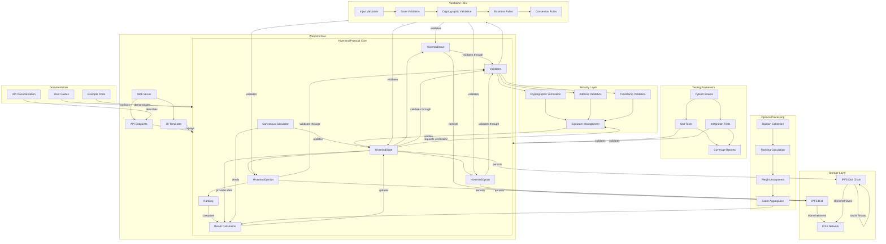

```mermaid
graph TB
    subgraph HivemindCore[Hivemind Protocol Core]
        direction TB
        A[HivemindState] --> B[HivemindIssue]
        A --> C[HivemindOption]
        A --> D[HivemindOpinion]
        D --> E[Ranking]
        
        B --> |validates through| F[Validators]
        C --> |validates through| F
        D --> |validates through| F
        A --> |validates through| F

        E --> |computes| R[Result Calculation]
        R --> |updates| A
        A --> |provides data| R

        CC[Consensus Calculator] --> |reads| R
        CC --> |updates| A
    end
    
    subgraph StorageLayer[Storage Layer]
        G[IPFS Dict]
        G2[IPFS Dict Chain]
        H[IPFS Network]
        G --> |stores/retrieves| H
        G2 --> |stores/retrieves| H
        G2 --> |tracks history| G2
    end
    
    subgraph SecurityLayer[Security Layer]
        I[Cryptographic Verification]
        J[Address Validation]
        K[Timestamp Validation]
        S[Signature Management]
        
        I --> S
        J --> S
        K --> S
    end

    subgraph WebInterface[Web Interface]
        WS[Web Server]
        API[API Endpoints]
        UI[UI Templates]
        
        WS --> API
        WS --> UI
        API --> |interacts| HivemindCore
        UI --> |displays| HivemindCore
    end

    subgraph TestingLayer[Testing Framework]
        L[Pytest Fixtures]
        M[Unit Tests]
        N[Integration Tests]
        O[Coverage Reports]
        
        L --> M
        L --> N
        M --> O
        N --> O
        M --> |validates| HivemindCore
        N --> |validates| HivemindCore
    end

    subgraph Documentation[Documentation]
        D1[API Documentation]
        D2[User Guides]
        D3[Example Code]
        
        D1 --> |describes| API
        D2 --> |explains| HivemindCore
        D3 --> |demonstrates| HivemindCore
    end
    
    F --> I
    F --> J
    F --> K
    
    B --> |persists| G
    C --> |persists| G
    D --> |persists| G
    A --> |persists| G2
    
    subgraph ValidationFlow[Validation Flow]
        V1[Input Validation]
        V2[State Validation]
        V3[Cryptographic Validation]
        V4[Business Rules]
        V5[Consensus Rules]
        
        V1 --> V2
        V2 --> V3
        V3 --> V4
        V4 --> V5
    end
    
    F --> ValidationFlow
    ValidationFlow --> |validates| B
    ValidationFlow --> |validates| C
    ValidationFlow --> |validates| D
    ValidationFlow --> |validates| A

    subgraph OpinionFlow[Opinion Processing]
        O1[Opinion Collection]
        O2[Ranking Calculation]
        O3[Weight Assignment]
        O4[Score Aggregation]
        
        O1 --> O2
        O2 --> O3
        O3 --> O4
        O4 --> R
    end

    S --> |verifies| A
    A --> |requests verification| S
```