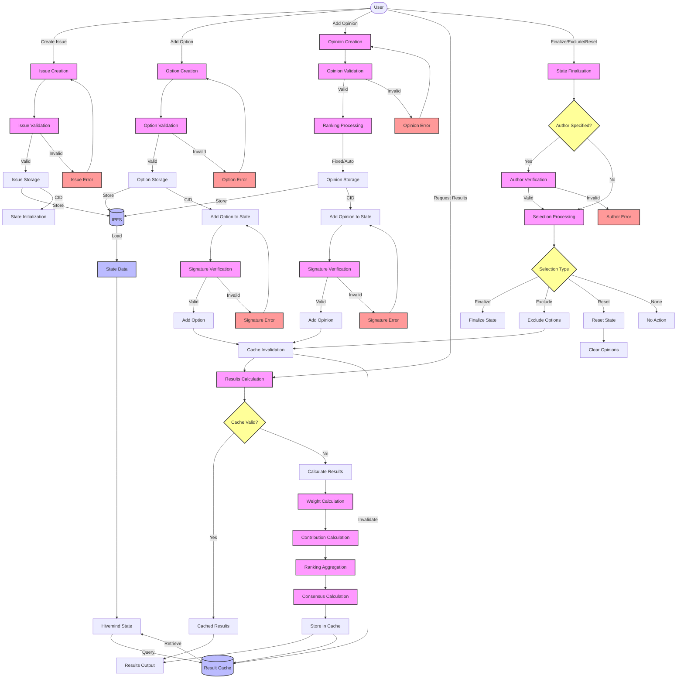

```mermaid
flowchart TD
    %% User Interactions
    User([User]) --> |Create Issue| I[Issue Creation]
    User --> |Add Option| O[Option Creation]
    User --> |Add Opinion| OP[Opinion Creation]
    User --> |Request Results| R[Results Calculation]
    User --> |Finalize/Exclude/Reset| F[State Finalization]
    
    %% Issue Flow
    I --> IV[Issue Validation]
    IV --> |Valid| IS[Issue Storage]
    IS --> |Store| IPFS[(IPFS)]
    IS --> |CID| StateInit[State Initialization]
    IV --> |Invalid| IE[Issue Error]
    IE --> I
    
    %% Option Flow
    O --> OV[Option Validation]
    OV --> |Valid| OS[Option Storage]
    OS --> |Store| IPFS
    OS --> |CID| StateOpt[Add Option to State]
    OV --> |Invalid| OE[Option Error]
    OE --> O
    
    %% Option Signature Verification
    StateOpt --> SigV[Signature Verification]
    SigV --> |Valid| AddOpt[Add Option]
    SigV --> |Invalid| SigE[Signature Error]
    SigE --> StateOpt
    
    %% Opinion Flow
    OP --> OPV[Opinion Validation]
    OPV --> |Valid| RankP[Ranking Processing]
    RankP --> |Fixed/Auto| OPS[Opinion Storage]
    OPS --> |Store| IPFS
    OPS --> |CID| StateOpin[Add Opinion to State]
    OPV --> |Invalid| OPE[Opinion Error]
    OPE --> OP
    
    %% Opinion Signature Verification
    StateOpin --> OSigV[Signature Verification]
    OSigV --> |Valid| AddOpin[Add Opinion]
    OSigV --> |Invalid| OSigE[Signature Error]
    OSigE --> StateOpin
    
    %% Cache Invalidation
    AddOpt --> CacheInv[Cache Invalidation]
    AddOpin --> CacheInv
    
    %% Results Calculation
    R --> CacheCheck{Cache Valid?}
    CacheCheck --> |Yes| CachedR[Cached Results]
    CacheCheck --> |No| CalcR[Calculate Results]
    
    %% Results Calculation Flow
    CalcR --> WeightCalc[Weight Calculation]
    WeightCalc --> ContribCalc[Contribution Calculation]
    ContribCalc --> RankAgg[Ranking Aggregation]
    RankAgg --> ConsCalc[Consensus Calculation]
    ConsCalc --> StoreCache[Store in Cache]
    
    %% Results Output
    CachedR --> ResultOut[Results Output]
    StoreCache --> ResultOut
    
    %% Finalization Flow
    F --> AuthorCheck{Author Specified?}
    AuthorCheck --> |Yes| AuthorV[Author Verification]
    AuthorCheck --> |No| SelProc[Selection Processing]
    
    %% Author Verification
    AuthorV --> |Valid| SelProc
    AuthorV --> |Invalid| AuthErr[Author Error]
    
    %% Selection Processing
    SelProc --> SelType{Selection Type}
    SelType --> |Finalize| Final[Finalize State]
    SelType --> |Exclude| Excl[Exclude Options]
    SelType --> |Reset| Rst[Reset State]
    SelType --> |None| None[No Action]
    
    %% Post-Selection Actions
    Excl --> CacheInv
    CacheInv --> R
    Rst --> ClearOpin[Clear Opinions]
    
    %% Data Storage
    IPFS --> |Load| StateData[State Data]
    StateData --> HivemindState[Hivemind State]
    
    %% Cache System
    HivemindState --> |Query| ResultCache[(Result Cache)]
    ResultCache --> |Retrieve| HivemindState
    StoreCache --> ResultCache
    CacheInv --> |Invalidate| ResultCache
    
    %% Style Definitions
    classDef process fill:#f9f,stroke:#333,stroke-width:2px;
    classDef storage fill:#bbf,stroke:#333,stroke-width:2px;
    classDef decision fill:#ff9,stroke:#333,stroke-width:2px;
    classDef error fill:#f99,stroke:#333,stroke-width:2px;
    
    class I,O,OP,R,F,IV,OV,OPV,SigV,OSigV,RankP,WeightCalc,ContribCalc,RankAgg,ConsCalc,AuthorV,SelProc process;
    class IPFS,ResultCache,StateData storage;
    class CacheCheck,AuthorCheck,SelType decision;
    class IE,OE,SigE,OPE,OSigE,AuthErr error;
```
