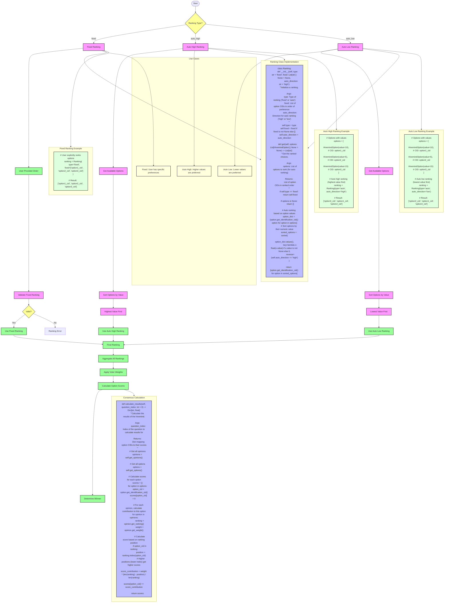

```mermaid
flowchart TD
    %% Main Entry Points
    Start([Start]) --> RankingType{Ranking Type?}
    
    %% Ranking Types
    RankingType --> |fixed| FixedRanking[Fixed Ranking]
    RankingType --> |auto_high| AutoHighRanking[Auto High Ranking]
    RankingType --> |auto_low| AutoLowRanking[Auto Low Ranking]
    
    %% Fixed Ranking Flow
    FixedRanking --> UserProvided[User Provided Order]
    UserProvided --> ValidateFixed[Validate Fixed Ranking]
    ValidateFixed --> FixedValid{Valid?}
    FixedValid --> |Yes| UseFixedRanking[Use Fixed Ranking]
    FixedValid --> |No| FixedError[Ranking Error]
    
    %% Auto High Ranking Flow
    AutoHighRanking --> GetOptions[Get Available Options]
    GetOptions --> SortByValue[Sort Options by Value]
    SortByValue --> HighestFirst[Highest Value First]
    HighestFirst --> UseAutoHighRanking[Use Auto High Ranking]
    
    %% Auto Low Ranking Flow
    AutoLowRanking --> GetOptionsLow[Get Available Options]
    GetOptionsLow --> SortByValueLow[Sort Options by Value]
    SortByValueLow --> LowestFirst[Lowest Value First]
    LowestFirst --> UseAutoLowRanking[Use Auto Low Ranking]
    
    %% Ranking Usage
    UseFixedRanking --> FinalRanking[Final Ranking]
    UseAutoHighRanking --> FinalRanking
    UseAutoLowRanking --> FinalRanking
    
    %% Consensus Calculation
    FinalRanking --> AggregateRankings[Aggregate All Rankings]
    AggregateRankings --> ApplyWeights[Apply Voter Weights]
    ApplyWeights --> CalculateScores[Calculate Option Scores]
    CalculateScores --> DetermineWinner[Determine Winner]
    
    %% Implementation Details
    subgraph RankingClass[Ranking Class Implementation]
        RankingCode["
        class Ranking:
            def __init__(self, type: str = 'fixed', fixed: List[str] | None = None, 
                        auto_direction: str = 'high'):
                '''Initialize a ranking.
                
                Args:
                    type: Type of ranking ('fixed' or 'auto')
                    fixed: List of option CIDs in order of preference
                    auto_direction: Direction for auto ranking ('high' or 'low')
                '''
                self.type = type
                self.fixed = fixed if fixed is not None else []
                self.auto_direction = auto_direction
                
            def get(self, options: List[HivemindOption] | None = None) -> List[str]:
                '''Get the ranked choices.
                
                Args:
                    options: List of options to rank (for auto ranking)
                    
                Returns:
                    List of option CIDs in ranked order
                '''
                if self.type == 'fixed':
                    return self.fixed
                    
                if options is None:
                    return []
                    
                # Auto ranking based on option values
                option_dict = {option.get_identification_cid(): option for option in options}
                
                # Sort options by their numeric value
                sorted_options = sorted(
                    option_dict.values(),
                    key=lambda x: float(x.value) if x.value is not None else 0,
                    reverse=(self.auto_direction == 'high')
                )
                
                return [option.get_identification_cid() for option in sorted_options]
        "]
    end
    
    subgraph FixedRankingExample[Fixed Ranking Example]
        FixedExample["
        # User explicitly ranks options
        ranking = Ranking(
            type='fixed',
            fixed=['option1_cid', 'option2_cid', 'option3_cid']
        )
        
        # Result: ['option1_cid', 'option2_cid', 'option3_cid']
        "]
    end
    
    subgraph AutoHighExample[Auto High Ranking Example]
        AutoHighEx["
        # Options with values
        options = [
            HivemindOption(value=10),  # CID: option1_cid
            HivemindOption(value=5),   # CID: option2_cid
            HivemindOption(value=15)   # CID: option3_cid
        ]
        
        # Auto high ranking (highest value first)
        ranking = Ranking(type='auto', auto_direction='high')
        
        # Result: ['option3_cid', 'option1_cid', 'option2_cid']
        "]
    end
    
    subgraph AutoLowExample[Auto Low Ranking Example]
        AutoLowEx["
        # Options with values
        options = [
            HivemindOption(value=10),  # CID: option1_cid
            HivemindOption(value=5),   # CID: option2_cid
            HivemindOption(value=15)   # CID: option3_cid
        ]
        
        # Auto low ranking (lowest value first)
        ranking = Ranking(type='auto', auto_direction='low')
        
        # Result: ['option2_cid', 'option1_cid', 'option3_cid']
        "]
    end
    
    %% Consensus Calculation Implementation
    subgraph ConsensusCalculation[Consensus Calculation]
        ConsensusCode["
        def calculate_results(self, question_index: int = 0) -> Dict[str, float]:
            '''Calculate the results of the hivemind.
            
            Args:
                question_index: Index of the question to calculate results for
                
            Returns:
                Dict mapping option CIDs to their scores
            '''
            # Get all opinions
            opinions = self.get_opinions()
            
            # Get all options
            options = self.get_options()
            
            # Calculate scores for each option
            scores = {}
            for option in options:
                option_cid = option.get_identification_cid()
                scores[option_cid] = 0
                
                # For each opinion, calculate contribution to this option
                for opinion in opinions:
                    ranking = opinion.get_ranking()
                    weight = opinion.get_weight()
                    
                    # Calculate score based on ranking position
                    if option_cid in ranking:
                        position = ranking.index(option_cid)
                        # Higher positions (lower index) get higher scores
                        score_contribution = weight * (len(ranking) - position) / len(ranking)
                        scores[option_cid] += score_contribution
                        
            return scores
        "]
    end
    
    %% Connections to Implementation
    FixedRanking --> RankingClass
    AutoHighRanking --> RankingClass
    AutoLowRanking --> RankingClass
    
    FixedRanking --> FixedRankingExample
    AutoHighRanking --> AutoHighExample
    AutoLowRanking --> AutoLowExample
    
    CalculateScores --> ConsensusCalculation
    
    %% Use Cases
    subgraph UseCases[Use Cases]
        UC1[Fixed: User has specific preferences]
        UC2[Auto High: Higher values are preferred]
        UC3[Auto Low: Lower values are preferred]
    end
    
    FixedRanking --> UC1
    AutoHighRanking --> UC2
    AutoLowRanking --> UC3
    
    %% Style Definitions
    classDef process fill:#f9f,stroke:#333,stroke-width:2px;
    classDef decision fill:#ff9,stroke:#333,stroke-width:2px;
    classDef action fill:#9f9,stroke:#333,stroke-width:2px;
    classDef implementation fill:#bbf,stroke:#333,stroke-width:2px;
    classDef example fill:#dfd,stroke:#333,stroke-width:2px;
    classDef usecase fill:#ffd,stroke:#333,stroke-width:2px;
    
    class FixedRanking,AutoHighRanking,AutoLowRanking,ValidateFixed,GetOptions,GetOptionsLow,SortByValue,SortByValueLow,HighestFirst,LowestFirst process;
    class RankingType,FixedValid decision;
    class UserProvided,UseFixedRanking,UseAutoHighRanking,UseAutoLowRanking,FinalRanking,AggregateRankings,ApplyWeights,CalculateScores,DetermineWinner action;
    class RankingCode,ConsensusCode implementation;
    class FixedExample,AutoHighEx,AutoLowEx example;
    class UC1,UC2,UC3 usecase;
```
