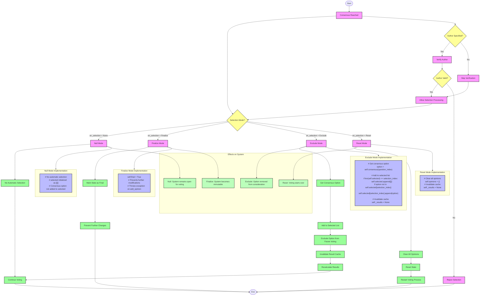

```mermaid
flowchart TD
    %% Main Entry Point
    Start([Start]) --> ConsensusReached[Consensus Reached]
    ConsensusReached --> SelectionMode{Selection Mode?}
    
    %% Selection Mode Paths
    SelectionMode --> |on_selection = None| NullMode[Null Mode]
    SelectionMode --> |on_selection = Finalize| FinalizeMode[Finalize Mode]
    SelectionMode --> |on_selection = Exclude| ExcludeMode[Exclude Mode]
    SelectionMode --> |on_selection = Reset| ResetMode[Reset Mode]
    
    %% Author Verification
    ConsensusReached --> AuthorCheck{Author Specified?}
    AuthorCheck --> |Yes| VerifyAuthor[Verify Author]
    AuthorCheck --> |No| SkipVerification[Skip Verification]
    
    VerifyAuthor --> AuthorValid{Author Valid?}
    AuthorValid --> |Yes| AllowSelection[Allow Selection Processing]
    AuthorValid --> |No| RejectSelection[Reject Selection]
    
    SkipVerification --> AllowSelection
    
    AllowSelection --> SelectionMode
    RejectSelection --> End([End])
    
    %% Null Mode Flow
    NullMode --> NullBehavior[No Automatic Selection]
    NullBehavior --> ContinueVoting[Continue Voting]
    ContinueVoting --> End
    
    %% Finalize Mode Flow
    FinalizeMode --> MarkFinal[Mark State as Final]
    MarkFinal --> PreventChanges[Prevent Further Changes]
    PreventChanges --> End
    
    %% Exclude Mode Flow
    ExcludeMode --> GetConsensus[Get Consensus Option]
    GetConsensus --> AddToSelected[Add to Selected List]
    AddToSelected --> ExcludeOption[Exclude Option from Future Voting]
    ExcludeOption --> InvalidateCache[Invalidate Result Cache]
    InvalidateCache --> RecalculateResults[Recalculate Results]
    RecalculateResults --> ContinueVoting
    
    %% Reset Mode Flow
    ResetMode --> ClearOpinions[Clear All Opinions]
    ClearOpinions --> ResetState[Reset State]
    ResetState --> RestartVoting[Restart Voting Process]
    RestartVoting --> End
    
    %% Implementation Details
    subgraph NullModeImpl[Null Mode Implementation]
        NullCode["
        # No automatic selection
        # selected initialized as [[]]
        # Consensus option not added to selected
        "]
    end
    
    subgraph FinalizeModeImpl[Finalize Mode Implementation]
        FinalizeCode["
        self.final = True
        # Prevents further modifications
        # Throws exception on add_opinion
        "]
    end
    
    subgraph ExcludeModeImpl[Exclude Mode Implementation]
        ExcludeCode["
        # Get consensus option
        option = self.consensus(question_index)
        
        # Add to selected list
        if len(self.selected) <= selection_index:
            self.selected.append([])
        if option not in self.selected[selection_index]:
            self.selected[selection_index].append(option)
            
        # Invalidate cache
        self._results = None
        "]
    end
    
    subgraph ResetModeImpl[Reset Mode Implementation]
        ResetCode["
        # Clear all opinions
        self.opinions = {}
        
        # Invalidate cache
        self._results = None
        "]
    end
    
    %% Connections to Implementation
    NullMode --> NullModeImpl
    FinalizeMode --> FinalizeModeImpl
    ExcludeMode --> ExcludeModeImpl
    ResetMode --> ResetModeImpl
    
    %% Effects on System
    subgraph SystemEffects[Effects on System]
        NullEffect[Null: System remains open for voting]
        FinalizeEffect[Finalize: System becomes immutable]
        ExcludeEffect[Exclude: Option removed from consideration]
        ResetEffect[Reset: Voting starts over]
    end
    
    NullMode --> NullEffect
    FinalizeMode --> FinalizeEffect
    ExcludeMode --> ExcludeEffect
    ResetMode --> ResetEffect
    
    %% Style Definitions
    classDef process fill:#f9f,stroke:#333,stroke-width:2px;
    classDef decision fill:#ff9,stroke:#333,stroke-width:2px;
    classDef action fill:#9f9,stroke:#333,stroke-width:2px;
    classDef implementation fill:#bbf,stroke:#333,stroke-width:2px;
    classDef effect fill:#bfb,stroke:#333,stroke-width:2px;
    
    class ConsensusReached,NullMode,FinalizeMode,ExcludeMode,ResetMode,VerifyAuthor,SkipVerification,AllowSelection,RejectSelection process;
    class SelectionMode,AuthorCheck,AuthorValid decision;
    class NullBehavior,ContinueVoting,MarkFinal,PreventChanges,GetConsensus,AddToSelected,ExcludeOption,InvalidateCache,RecalculateResults,ClearOpinions,ResetState,RestartVoting action;
    class NullCode,FinalizeCode,ExcludeCode,ResetCode implementation;
    class NullEffect,FinalizeEffect,ExcludeEffect,ResetEffect effect;
```
