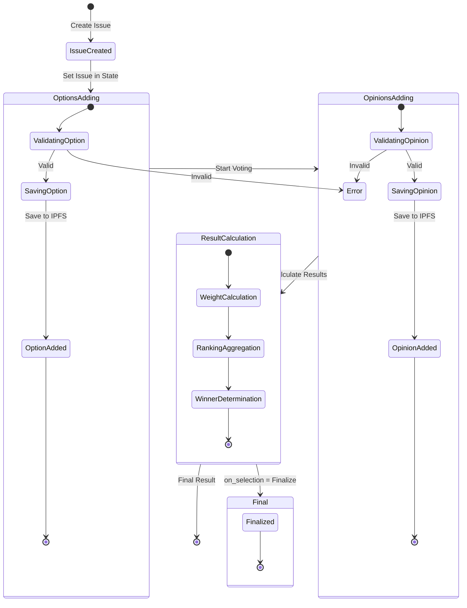

```mermaid
stateDiagram-v2
    [*] --> IssueCreated: Create Issue
    IssueCreated --> OptionsAdding: Set Issue in State
    
    state OptionsAdding {
        [*] --> ValidatingOption
        ValidatingOption --> SavingOption: Valid
        ValidatingOption --> Error: Invalid
        SavingOption --> OptionAdded: Save to IPFS
        OptionAdded --> [*]
    }
    
    state OpinionsAdding {
        [*] --> ValidatingOpinion
        ValidatingOpinion --> SavingOpinion: Valid
        ValidatingOpinion --> Error: Invalid
        SavingOpinion --> OpinionAdded: Save to IPFS
        OpinionAdded --> [*]
    }
    
    OptionsAdding --> OpinionsAdding: Start Voting
    OpinionsAdding --> ResultCalculation: Calculate Results
    
    state ResultCalculation {
        [*] --> WeightCalculation
        WeightCalculation --> RankingAggregation
        RankingAggregation --> WinnerDetermination
        WinnerDetermination --> [*]
    }
    
    ResultCalculation --> [*]: Final Result
    
    state "Final" as Final {
        Finalized --> [*]
    }
    
    ResultCalculation --> Final: on_selection = Finalize
```
