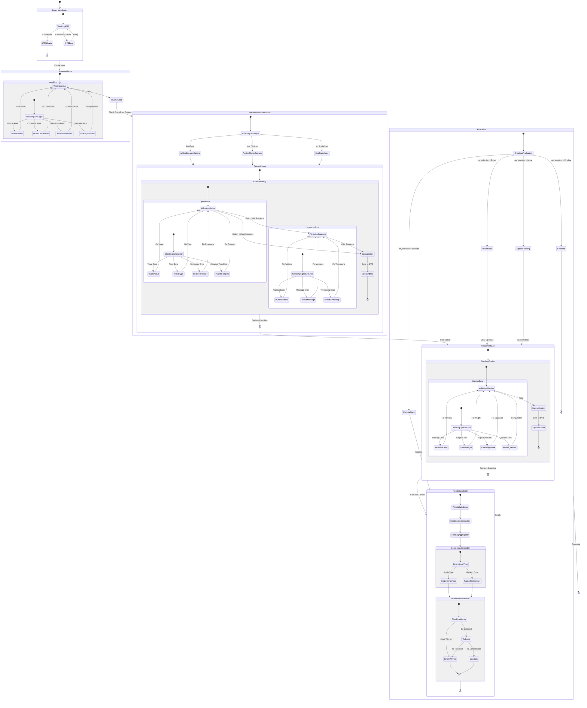

```mermaid
stateDiagram-v2
    [*] --> SystemInitialization
    
    state SystemInitialization {
        [*] --> CheckingIPFS
        CheckingIPFS --> IPFSReady: Connected
        CheckingIPFS --> IPFSError: Connection Failed
        IPFSError --> CheckingIPFS: Retry
        IPFSReady --> [*]
    }
    
    SystemInitialization --> IssueValidation: Create Issue
    
    state IssueValidation {
        [*] --> ValidatingIssue
        ValidatingIssue --> IssueCreated: Valid
        ValidatingIssue --> IssueError: Invalid
        
        state IssueError {
            [*] --> CheckingErrorType
            CheckingErrorType --> InvalidFormat: Format Error
            CheckingErrorType --> InvalidConstraints: Constraint Error
            CheckingErrorType --> InvalidRestrictions: Restriction Error
            CheckingErrorType --> InvalidQuestions: Questions Error
            
            InvalidFormat --> ValidatingIssue: Fix Format
            InvalidConstraints --> ValidatingIssue: Fix Constraints
            InvalidRestrictions --> ValidatingIssue: Fix Restrictions
            InvalidQuestions --> ValidatingIssue: Fix Questions
        }
    }
    
    IssueCreated --> PredefinedOptionsPhase: Check Predefined Options
    
    state PredefinedOptionsPhase {
        [*] --> CheckingIssueType
        CheckingIssueType --> AddingBooleanOptions: Bool Type
        CheckingIssueType --> AddingChoiceOptions: Has Choices
        CheckingIssueType --> SkipPredefined: No Predefined
        
        AddingBooleanOptions --> OptionsPhase
        AddingChoiceOptions --> OptionsPhase
        SkipPredefined --> OptionsPhase
    }
    
    state OptionsPhase {
        [*] --> OptionsAdding
        
        state OptionsAdding {
            [*] --> ValidatingOption
            ValidatingOption --> VerifyingSignature: Option with Signature
            ValidatingOption --> SavingOption: Option without Signature
            VerifyingSignature --> SavingOption: Valid Signature
            VerifyingSignature --> SignatureError: Invalid Signature
            ValidatingOption --> OptionError: Invalid
            SavingOption --> OptionAdded: Save to IPFS
            OptionAdded --> [*]
            
            state OptionError {
                [*] --> CheckingOptionError
                CheckingOptionError --> InvalidValue: Value Error
                CheckingOptionError --> InvalidType: Type Error
                CheckingOptionError --> InvalidReference: Reference Error
                CheckingOptionError --> InvalidComplex: Complex Type Error
                
                InvalidValue --> ValidatingOption: Fix Value
                InvalidType --> ValidatingOption: Fix Type
                InvalidReference --> ValidatingOption: Fix Reference
                InvalidComplex --> ValidatingOption: Fix Complex
            }
            
            state SignatureError {
                [*] --> CheckingSignatureError
                CheckingSignatureError --> InvalidAddress: Address Error
                CheckingSignatureError --> InvalidMessage: Message Error
                CheckingSignatureError --> InvalidTimestamp: Timestamp Error
                
                InvalidAddress --> VerifyingSignature: Fix Address
                InvalidMessage --> VerifyingSignature: Fix Message
                InvalidTimestamp --> VerifyingSignature: Fix Timestamp
            }
        }
        
        OptionsAdding --> [*]: Options Complete
    }
    
    OptionsPhase --> OpinionsPhase: Start Voting
    
    state OpinionsPhase {
        [*] --> OpinionsAdding
        
        state OpinionsAdding {
            [*] --> ValidatingOpinion
            ValidatingOpinion --> SavingOpinion: Valid
            ValidatingOpinion --> OpinionError: Invalid
            SavingOpinion --> OpinionAdded: Save to IPFS
            OpinionAdded --> [*]
            
            state OpinionError {
                [*] --> CheckingOpinionError
                CheckingOpinionError --> InvalidRanking: Ranking Error
                CheckingOpinionError --> InvalidWeight: Weight Error
                CheckingOpinionError --> InvalidSignature: Signature Error
                CheckingOpinionError --> InvalidQuestion: Question Error
                
                InvalidRanking --> ValidatingOpinion: Fix Ranking
                InvalidWeight --> ValidatingOpinion: Fix Weight
                InvalidSignature --> ValidatingOpinion: Fix Signature
                InvalidQuestion --> ValidatingOpinion: Fix Question
            }
        }
        
        OpinionsAdding --> [*]: Opinions Complete
    }
    
    OpinionsPhase --> ResultCalculation: Calculate Results
    
    state ResultCalculation {
        [*] --> WeightCalculation
        WeightCalculation --> ContributionCalculation
        ContributionCalculation --> RankingAggregation
        RankingAggregation --> ConsensusCalculation
        
        state ConsensusCalculation {
            [*] --> DeterminingType
            DeterminingType --> SingleConsensus: Single Type
            DeterminingType --> RankedConsensus: Ranked Type
            
            SingleConsensus --> WinnerDetermination
            RankedConsensus --> WinnerDetermination
        }
        
        state WinnerDetermination {
            [*] --> CheckingWinner
            CheckingWinner --> SingleWinner: Clear Winner
            CheckingWinner --> TieBreak: Tie Detected
            
            TieBreak --> SingleWinner: Tie Resolved
            TieBreak --> Deadlock: Tie Unresolvable
            
            SingleWinner --> [*]
            Deadlock --> [*]
        }
        
        WinnerDetermination --> [*]
    }
    
    ResultCalculation --> FinalState: Results Ready
    
    state FinalState {
        [*] --> CheckingFinalization
        CheckingFinalization --> Finalized: on_selection = Finalize
        CheckingFinalization --> ExcludeState: on_selection = Exclude
        CheckingFinalization --> ResetState: on_selection = Reset
        CheckingFinalization --> UpdatePending: on_selection = None
        
        ExcludeState --> ResultCalculation: Recalculate
        ResetState --> OpinionsPhase: Clear Opinions
        UpdatePending --> OpinionsPhase: Allow Updates
        Finalized --> [*]
    }
    
    FinalState --> [*]: Complete
```