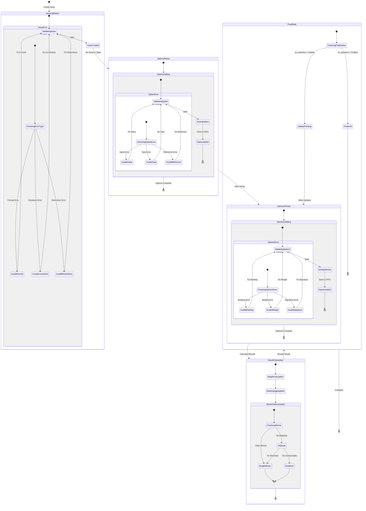

```mermaid
stateDiagram-v2
    [*] --> IssueValidation: Create Issue
    
    state IssueValidation {
        [*] --> ValidatingIssue
        ValidatingIssue --> IssueCreated: Valid
        ValidatingIssue --> IssueError: Invalid
        
        state IssueError {
            [*] --> CheckingErrorType
            CheckingErrorType --> InvalidFormat: Format Error
            CheckingErrorType --> InvalidConstraints: Constraint Error
            CheckingErrorType --> InvalidRestrictions: Restriction Error
            
            InvalidFormat --> ValidatingIssue: Fix Format
            InvalidConstraints --> ValidatingIssue: Fix Constraints
            InvalidRestrictions --> ValidatingIssue: Fix Restrictions
        }
    }
    
    IssueCreated --> OptionsPhase: Set Issue in State
    
    state OptionsPhase {
        [*] --> OptionsAdding
        
        state OptionsAdding {
            [*] --> ValidatingOption
            ValidatingOption --> SavingOption: Valid
            ValidatingOption --> OptionError: Invalid
            SavingOption --> OptionAdded: Save to IPFS
            OptionAdded --> [*]
            
            state OptionError {
                [*] --> CheckingOptionError
                CheckingOptionError --> InvalidValue: Value Error
                CheckingOptionError --> InvalidType: Type Error
                CheckingOptionError --> InvalidReference: Reference Error
                
                InvalidValue --> ValidatingOption: Fix Value
                InvalidType --> ValidatingOption: Fix Type
                InvalidReference --> ValidatingOption: Fix Reference
            }
        }
        
        OptionsAdding --> [*]: Options Complete
    }
    
    OptionsPhase --> OpinionsPhase: Start Voting
    
    state OpinionsPhase {
        [*] --> OpinionsAdding
        
        state OpinionsAdding {
            [*] --> ValidatingOpinion
            ValidatingOpinion --> SavingOpinion: Valid
            ValidatingOpinion --> OpinionError: Invalid
            SavingOpinion --> OpinionAdded: Save to IPFS
            OpinionAdded --> [*]
            
            state OpinionError {
                [*] --> CheckingOpinionError
                CheckingOpinionError --> InvalidRanking: Ranking Error
                CheckingOpinionError --> InvalidWeight: Weight Error
                CheckingOpinionError --> InvalidSignature: Signature Error
                
                InvalidRanking --> ValidatingOpinion: Fix Ranking
                InvalidWeight --> ValidatingOpinion: Fix Weight
                InvalidSignature --> ValidatingOpinion: Fix Signature
            }
        }
        
        OpinionsAdding --> [*]: Opinions Complete
    }
    
    OpinionsPhase --> ResultCalculation: Calculate Results
    
    state ResultCalculation {
        [*] --> WeightCalculation
        WeightCalculation --> RankingAggregation
        RankingAggregation --> WinnerDetermination
        
        state WinnerDetermination {
            [*] --> CheckingWinner
            CheckingWinner --> SingleWinner: Clear Winner
            CheckingWinner --> TieBreak: Tie Detected
            
            TieBreak --> SingleWinner: Tie Resolved
            TieBreak --> Deadlock: Tie Unresolvable
            
            SingleWinner --> [*]
            Deadlock --> [*]
        }
        
        WinnerDetermination --> [*]
    }
    
    ResultCalculation --> FinalState: Results Ready
    
    state FinalState {
        [*] --> CheckingFinalization
        CheckingFinalization --> Finalized: on_selection = Finalize
        CheckingFinalization --> UpdatePending: on_selection = Update
        
        UpdatePending --> OpinionsPhase: Allow Updates
        Finalized --> [*]
    }
    
    FinalState --> [*]: Complete
```