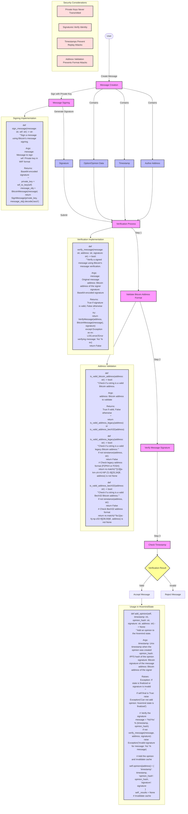

```mermaid
flowchart TD
    %% Main Components
    User([User]) --> |Create Message| M[Message Creation]
    M --> |Sign with Private Key| S[Message Signing]
    S --> |Generate Signature| SIG[Signature]
    
    %% Message Components
    M --> |Contains| MC1[Option/Opinion Data]
    M --> |Contains| MC2[Timestamp]
    M --> |Contains| MC3[Author Address]
    
    %% Verification Flow
    SIG --> |Submit| V[Verification Process]
    MC1 --> V
    MC2 --> V
    MC3 --> V
    
    %% Verification Steps
    V --> |Step 1| V1[Validate Bitcoin Address Format]
    V1 --> |Step 2| V2[Verify Message Signature]
    V2 --> |Step 3| V3[Check Timestamp]
    
    %% Verification Outcomes
    V3 --> VResult{Verification Result}
    VResult --> |Valid| Accept[Accept Message]
    VResult --> |Invalid| Reject[Reject Message]
    
    %% Implementation Details
    subgraph SigningImplementation[Signing Implementation]
        SignCode["
        def sign_message(message: str, wif: str) -> str:
            '''Sign a message using Bitcoin's message signing.
            
            Args:
                message: Message to sign
                wif: Private key in WIF format
                
            Returns:
                Base64-encoded signature
            '''
            private_key = wif_to_key(wif)
            message_obj = BitcoinMessage(message)
            return SignMessage(private_key, message_obj).decode('ascii')
        "]
    end
    
    subgraph VerificationImplementation[Verification Implementation]
        VerifyCode["
        def verify_message(message: str, address: str, signature: str) -> bool:
            '''Verify a signed message using Bitcoin's message verification.
            
            Args:
                message: Original message
                address: Bitcoin address of the signer
                signature: Base64-encoded signature
                
            Returns:
                True if signature is valid, False otherwise
            '''
            try:
                return VerifyMessage(address, BitcoinMessage(message), signature)
            except Exception as ex:
                LOG.error('Error verifying message: %s' % ex)
                return False
        "]
    end
    
    subgraph AddressValidation[Address Validation]
        ValidateCode["
        def is_valid_bitcoin_address(address: str) -> bool:
            '''Check if a string is a valid Bitcoin address.
            
            Args:
                address: Bitcoin address to validate
                
            Returns:
                True if valid, False otherwise
            '''
            return is_valid_address_legacy(address) or is_valid_address_bech32(address)
            
        def is_valid_address_legacy(address: str) -> bool:
            '''Check if a string is a valid legacy Bitcoin address.'''
            if not isinstance(address, str):
                return False
            # Check legacy address format (P2PKH or P2SH)
            return re.match(r'^[13][a-km-zA-HJ-NP-Z1-9]{25,34}$', address) is not None
            
        def is_valid_address_bech32(address: str) -> bool:
            '''Check if a string is a valid Bech32 Bitcoin address.'''
            if not isinstance(address, str):
                return False
            # Check Bech32 address format
            return re.match(r'^bc1[ac-hj-np-z02-9]{39,59}$', address) is not None
        "]
    end
    
    %% Usage in HivemindState
    subgraph StateUsage[Usage in HivemindState]
        AddOpinionCode["
        def add_opinion(self, timestamp: int, opinion_hash: str, signature: str, address: str) -> None:
            '''Add an opinion to the hivemind state.
            
            Args:
                timestamp: Unix timestamp when the opinion was created
                opinion_hash: IPFS hash of the opinion
                signature: Bitcoin signature of the message
                address: Bitcoin address of the signer
                
            Raises:
                Exception: If state is finalized or signature is invalid
            '''
            if self.final is True:
                raise Exception('Can not add opinion: hivemind state is finalized')
                
            # Verify the signature
            message = '%d:%s' % (timestamp, opinion_hash)
            if not verify_message(message, address, signature):
                raise Exception('Invalid signature for message: %s' % message)
                
            # Add the opinion and invalidate cache
            self.opinions[address] = {
                'timestamp': timestamp,
                'opinion_hash': opinion_hash,
                'signature': signature
            }
            self._results = None  # Invalidate cache
        "]
    end
    
    %% Connections
    S --> SigningImplementation
    V --> VerificationImplementation
    V1 --> AddressValidation
    Accept --> StateUsage
    
    %% Security Considerations
    subgraph SecurityConsiderations[Security Considerations]
        S1[Private Keys Never Transmitted]
        S2[Signatures Verify Identity]
        S3[Timestamps Prevent Replay Attacks]
        S4[Address Validation Prevents Format Attacks]
    end
    
    %% Style Definitions
    classDef process fill:#f9f,stroke:#333,stroke-width:2px;
    classDef data fill:#bbf,stroke:#333,stroke-width:2px;
    classDef decision fill:#ff9,stroke:#333,stroke-width:2px;
    classDef implementation fill:#ddf,stroke:#333,stroke-width:2px;
    classDef security fill:#fdd,stroke:#333,stroke-width:2px;
    
    class M,S,V,V1,V2,V3 process;
    class MC1,MC2,MC3,SIG data;
    class VResult decision;
    class SignCode,VerifyCode,ValidateCode,AddOpinionCode implementation;
    class S1,S2,S3,S4 security;
```
