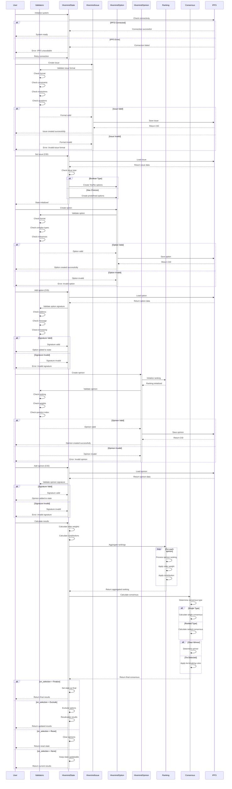

```mermaid
sequenceDiagram
    participant User
    participant Validators
    participant HivemindState
    participant HivemindIssue
    participant HivemindOption
    participant HivemindOpinion
    participant Ranking
    participant Consensus
    participant IPFS
    
    %% System Initialization
    User->>HivemindState: Initialize system
    activate HivemindState
    HivemindState->>IPFS: Check connectivity
    alt IPFS Connected
        IPFS-->>HivemindState: Connection successful
        HivemindState-->>User: System ready
    else IPFS Error
        IPFS-->>HivemindState: Connection failed
        HivemindState-->>User: Error: IPFS unavailable
        User->>HivemindState: Retry connection
    end
    deactivate HivemindState
    
    %% Issue Creation and Validation
    User->>HivemindIssue: Create issue
    activate HivemindIssue
    HivemindIssue->>Validators: Validate issue format
    Validators->>Validators: Check format
    Validators->>Validators: Check constraints
    Validators->>Validators: Check restrictions
    Validators->>Validators: Check questions
    alt Issue Valid
        Validators-->>HivemindIssue: Format valid
        HivemindIssue->>IPFS: Save issue
        IPFS-->>HivemindIssue: Return CID
        HivemindIssue-->>User: Issue created successfully
    else Issue Invalid
        Validators-->>HivemindIssue: Format invalid
        HivemindIssue-->>User: Error: Invalid issue format
    end
    deactivate HivemindIssue
    
    %% State Initialization
    User->>HivemindState: Set issue (CID)
    activate HivemindState
    HivemindState->>IPFS: Load issue
    IPFS-->>HivemindState: Return issue data
    
    %% Handle Predefined Options
    HivemindState->>HivemindState: Check issue type
    alt Boolean Type
        HivemindState->>HivemindOption: Create Yes/No options
    else Has Choices
        HivemindState->>HivemindOption: Create predefined options
    end
    HivemindState-->>User: State initialized
    deactivate HivemindState
    
    %% Option Creation and Validation
    User->>HivemindOption: Create option
    activate HivemindOption
    HivemindOption->>Validators: Validate option
    Validators->>Validators: Check format
    Validators->>Validators: Check complex types
    Validators->>Validators: Check references
    alt Option Valid
        Validators-->>HivemindOption: Option valid
        HivemindOption->>IPFS: Save option
        IPFS-->>HivemindOption: Return CID
        HivemindOption-->>User: Option created successfully
    else Option Invalid
        Validators-->>HivemindOption: Option invalid
        HivemindOption-->>User: Error: Invalid option
    end
    deactivate HivemindOption
    
    %% Add Option to State
    User->>HivemindState: Add option (CID)
    activate HivemindState
    HivemindState->>IPFS: Load option
    IPFS-->>HivemindState: Return option data
    HivemindState->>Validators: Validate option signature
    Validators->>Validators: Check address
    Validators->>Validators: Check message
    Validators->>Validators: Check timestamp
    alt Signature Valid
        Validators-->>HivemindState: Signature valid
        HivemindState-->>User: Option added to state
    else Signature Invalid
        Validators-->>HivemindState: Signature invalid
        HivemindState-->>User: Error: Invalid signature
    end
    deactivate HivemindState
    
    %% Opinion Creation with Ranking
    User->>HivemindOpinion: Create opinion
    activate HivemindOpinion
    HivemindOpinion->>Ranking: Initialize ranking
    Ranking-->>HivemindOpinion: Ranking initialized
    HivemindOpinion->>Validators: Validate opinion
    Validators->>Validators: Check ranking
    Validators->>Validators: Check weights
    Validators->>Validators: Check question index
    alt Opinion Valid
        Validators-->>HivemindOpinion: Opinion valid
        HivemindOpinion->>IPFS: Save opinion
        IPFS-->>HivemindOpinion: Return CID
        HivemindOpinion-->>User: Opinion created successfully
    else Opinion Invalid
        Validators-->>HivemindOpinion: Opinion invalid
        HivemindOpinion-->>User: Error: Invalid opinion
    end
    deactivate HivemindOpinion
    
    %% Add Opinion to State
    User->>HivemindState: Add opinion (CID)
    activate HivemindState
    HivemindState->>IPFS: Load opinion
    IPFS-->>HivemindState: Return opinion data
    HivemindState->>Validators: Validate opinion signature
    alt Signature Valid
        Validators-->>HivemindState: Signature valid
        HivemindState-->>User: Opinion added to state
    else Signature Invalid
        Validators-->>HivemindState: Signature invalid
        HivemindState-->>User: Error: Invalid signature
    end
    deactivate HivemindState
    
    %% Calculate Results
    User->>HivemindState: Calculate results
    activate HivemindState
    
    %% Weight and Contribution Calculation
    HivemindState->>HivemindState: Calculate voter weights
    HivemindState->>HivemindState: Calculate contributions
    
    %% Ranking Aggregation
    HivemindState->>Ranking: Aggregate rankings
    activate Ranking
    loop For each opinion
        Ranking->>Ranking: Process opinion ranking
        Ranking->>Ranking: Apply voter weight
        Ranking->>Ranking: Apply contribution
    end
    Ranking-->>HivemindState: Return aggregated ranking
    deactivate Ranking
    
    %% Consensus Calculation
    HivemindState->>Consensus: Calculate consensus
    activate Consensus
    Consensus->>Consensus: Determine consensus type
    alt Single Type
        Consensus->>Consensus: Calculate single consensus
    else Ranked Type
        Consensus->>Consensus: Calculate ranked consensus
    end
    
    %% Handle Ties
    alt Clear Winner
        Consensus->>Consensus: Determine winner
    else Tie Detected
        Consensus->>Consensus: Apply tie-breaking rules
    end
    Consensus-->>HivemindState: Return final consensus
    deactivate Consensus
    
    %% Finalization
    alt on_selection = Finalize
        HivemindState->>HivemindState: Set state as final
        HivemindState-->>User: Return final results
    else on_selection = Exclude
        HivemindState->>HivemindState: Exclude options
        HivemindState->>HivemindState: Recalculate results
        HivemindState-->>User: Return updated results
    else on_selection = Reset
        HivemindState->>HivemindState: Clear opinions
        HivemindState-->>User: Return reset state
    else on_selection = None
        HivemindState->>HivemindState: Keep state updateable
        HivemindState-->>User: Return current results
    end
    deactivate HivemindState
```
