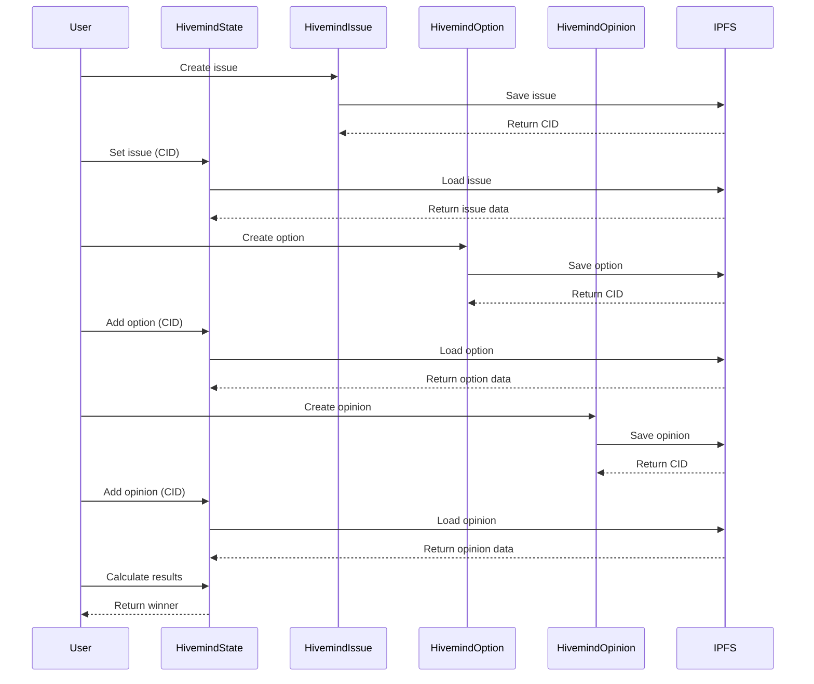

```mermaid
sequenceDiagram
    participant User
    participant HivemindState
    participant HivemindIssue
    participant HivemindOption
    participant HivemindOpinion
    participant IPFS

    User->>HivemindIssue: Create issue
    HivemindIssue->>IPFS: Save issue
    IPFS-->>HivemindIssue: Return CID
    
    User->>HivemindState: Set issue (CID)
    HivemindState->>IPFS: Load issue
    IPFS-->>HivemindState: Return issue data
    
    User->>HivemindOption: Create option
    HivemindOption->>IPFS: Save option
    IPFS-->>HivemindOption: Return CID
    
    User->>HivemindState: Add option (CID)
    HivemindState->>IPFS: Load option
    IPFS-->>HivemindState: Return option data
    
    User->>HivemindOpinion: Create opinion
    HivemindOpinion->>IPFS: Save opinion
    IPFS-->>HivemindOpinion: Return CID
    
    User->>HivemindState: Add opinion (CID)
    HivemindState->>IPFS: Load opinion
    IPFS-->>HivemindState: Return opinion data
    
    User->>HivemindState: Calculate results
    HivemindState-->>User: Return winner
```
