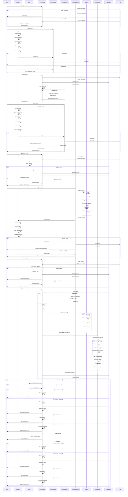

```mermaid
sequenceDiagram
    participant User
    participant Validators
    participant Utils
    participant HivemindState
    participant HivemindIssue
    participant HivemindOption
    participant HivemindOpinion
    participant Ranking
    participant Consensus
    participant ResultCache
    participant IPFS
    
    %% System Initialization
    User->>HivemindState: Initialize system
    activate HivemindState
    HivemindState->>IPFS: Check connectivity
    alt IPFS Connected
        IPFS-->>HivemindState: Connection successful
        HivemindState-->>User: System ready
    else IPFS Error
        IPFS-->>HivemindState: Connection failed
        HivemindState-->>User: Error: IPFS unavailable
        User->>HivemindState: Retry connection
    end
    deactivate HivemindState
    
    %% Issue Creation and Validation
    User->>HivemindIssue: Create issue
    activate HivemindIssue
    HivemindIssue->>Validators: Validate issue format
    Validators->>Validators: Check format
    Validators->>Validators: Check constraints
    Validators->>Validators: Check restrictions
    Validators->>Validators: Check questions
    Validators->>Validators: Check author address
    alt Issue Valid
        Validators-->>HivemindIssue: Format valid
        HivemindIssue->>IPFS: Save issue
        IPFS-->>HivemindIssue: Return CID
        HivemindIssue-->>User: Issue created successfully
    else Issue Invalid
        Validators-->>HivemindIssue: Format invalid
        HivemindIssue-->>User: Error: Invalid issue format
    end
    deactivate HivemindIssue
    
    %% State Initialization
    User->>HivemindState: Set issue (CID)
    activate HivemindState
    HivemindState->>IPFS: Load issue
    IPFS-->>HivemindState: Return issue data
    HivemindState->>ResultCache: Initialize cache
    ResultCache-->>HivemindState: Cache initialized
    
    %% Handle Predefined Options
    HivemindState->>HivemindState: Check issue type
    alt Boolean Type
        HivemindState->>HivemindOption: Create Yes/No options
    else Has Choices
        HivemindState->>HivemindOption: Create predefined options
    end
    HivemindState-->>User: State initialized
    deactivate HivemindState
    
    %% Option Creation and Validation
    User->>HivemindOption: Create option
    activate HivemindOption
    HivemindOption->>Validators: Validate option
    Validators->>Validators: Check format
    Validators->>Validators: Check complex types
    Validators->>Validators: Check references
    Validators->>Validators: Check text format
    Validators->>Validators: Check file format
    Validators->>Validators: Check address format
    alt Option Valid
        Validators-->>HivemindOption: Option valid
        HivemindOption->>IPFS: Save option
        IPFS-->>HivemindOption: Return CID
        HivemindOption-->>User: Option created successfully
    else Option Invalid
        Validators-->>HivemindOption: Option invalid
        HivemindOption-->>User: Error: Invalid option
    end
    deactivate HivemindOption
    
    %% Add Option to State
    User->>HivemindState: Add option (CID)
    activate HivemindState
    HivemindState->>IPFS: Load option
    IPFS-->>HivemindState: Return option data
    HivemindState->>Utils: Verify option signature
    Utils->>Utils: Verify message
    alt Signature Valid
        Utils-->>HivemindState: Signature valid
        HivemindState->>ResultCache: Invalidate cache
        ResultCache-->>HivemindState: Cache invalidated
        HivemindState-->>User: Option added to state
    else Signature Invalid
        Utils-->>HivemindState: Signature invalid
        HivemindState-->>User: Error: Invalid signature
    end
    deactivate HivemindState
    
    %% Opinion Creation with Ranking
    User->>HivemindOpinion: Create opinion
    activate HivemindOpinion
    HivemindOpinion->>Ranking: Initialize ranking
    alt Fixed Ranking
        Ranking->>Ranking: Set fixed ranking
    else Auto High Ranking
        Ranking->>Ranking: Set auto_high ranking
    else Auto Low Ranking
        Ranking->>Ranking: Set auto_low ranking
    end
    Ranking-->>HivemindOpinion: Ranking initialized
    HivemindOpinion->>Validators: Validate opinion
    Validators->>Validators: Check ranking
    Validators->>Validators: Check weights
    Validators->>Validators: Check question index
    Validators->>Validators: Check options exist
    alt Opinion Valid
        Validators-->>HivemindOpinion: Opinion valid
        HivemindOpinion->>IPFS: Save opinion
        IPFS-->>HivemindOpinion: Return CID
        HivemindOpinion-->>User: Opinion created successfully
    else Opinion Invalid
        Validators-->>HivemindOpinion: Opinion invalid
        HivemindOpinion-->>User: Error: Invalid opinion
    end
    deactivate HivemindOpinion
    
    %% Add Opinion to State
    User->>HivemindState: Add opinion (CID)
    activate HivemindState
    HivemindState->>IPFS: Load opinion
    IPFS-->>HivemindState: Return opinion data
    HivemindState->>Utils: Verify opinion signature
    alt Signature Valid
        Utils-->>HivemindState: Signature valid
        HivemindState->>ResultCache: Invalidate cache
        ResultCache-->>HivemindState: Cache invalidated
        HivemindState-->>User: Opinion added to state
    else Signature Invalid
        Utils-->>HivemindState: Signature invalid
        HivemindState-->>User: Error: Invalid signature
    end
    deactivate HivemindState
    
    %% Calculate Results
    User->>HivemindState: Calculate results
    activate HivemindState
    
    %% Check Cache
    HivemindState->>ResultCache: Check cache
    alt Cache Valid
        ResultCache-->>HivemindState: Return cached results
    else Cache Invalid
        ResultCache-->>HivemindState: Cache miss
        
        %% Weight and Contribution Calculation
        HivemindState->>HivemindState: Calculate voter weights
        HivemindState->>HivemindState: Calculate contributions
        
        %% Ranking Aggregation
        HivemindState->>Ranking: Aggregate rankings
        activate Ranking
        loop For each opinion
            Ranking->>Ranking: Process opinion ranking
            Ranking->>Ranking: Apply voter weight
            Ranking->>Ranking: Apply contribution
        end
        Ranking-->>HivemindState: Return aggregated ranking
        deactivate Ranking
        
        %% Consensus Calculation
        HivemindState->>Consensus: Calculate consensus
        activate Consensus
        Consensus->>Consensus: Determine consensus type
        alt Single Type
            Consensus->>Consensus: Calculate single consensus
        else Ranked Type
            Consensus->>Consensus: Calculate ranked consensus
        end
        
        %% Handle Ties
        alt Clear Winner
            Consensus->>Consensus: Determine winner
        else Tie Detected
            Consensus->>Consensus: Apply tie-breaking rules
        end
        Consensus-->>HivemindState: Return final consensus
        deactivate Consensus
        
        %% Store Results in Cache
        HivemindState->>ResultCache: Store results
        ResultCache-->>HivemindState: Results cached
    end
    
    %% Finalization
    alt Author Specified
        HivemindState->>Utils: Verify author
        alt Author Valid
            Utils-->>HivemindState: Author verified
            
            %% Selection Processing
            alt on_selection = Finalize
                HivemindState->>HivemindState: Set state as final
                HivemindState-->>User: Return final results
            else on_selection = Exclude
                HivemindState->>HivemindState: Exclude options
                HivemindState->>ResultCache: Invalidate cache
                HivemindState->>HivemindState: Recalculate results
                HivemindState-->>User: Return updated results
            else on_selection = Reset
                HivemindState->>HivemindState: Clear opinions
                HivemindState-->>User: Return reset state
            else on_selection = None
                HivemindState->>HivemindState: Keep state updateable
                HivemindState-->>User: Return current results
            end
        else Author Invalid
            Utils-->>HivemindState: Author verification failed
            HivemindState-->>User: Error: Invalid author
        end
    else No Author
        %% Selection Processing
        alt on_selection = Finalize
            HivemindState->>HivemindState: Set state as final
            HivemindState-->>User: Return final results
        else on_selection = Exclude
            HivemindState->>HivemindState: Exclude options
            HivemindState->>ResultCache: Invalidate cache
            HivemindState->>HivemindState: Recalculate results
            HivemindState-->>User: Return updated results
        else on_selection = Reset
            HivemindState->>HivemindState: Clear opinions
            HivemindState-->>User: Return reset state
        else on_selection = None
            HivemindState->>HivemindState: Keep state updateable
            HivemindState-->>User: Return current results
        end
    end
    deactivate HivemindState
```
