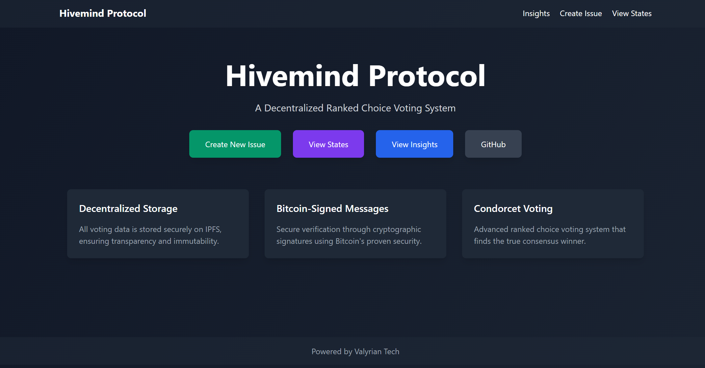
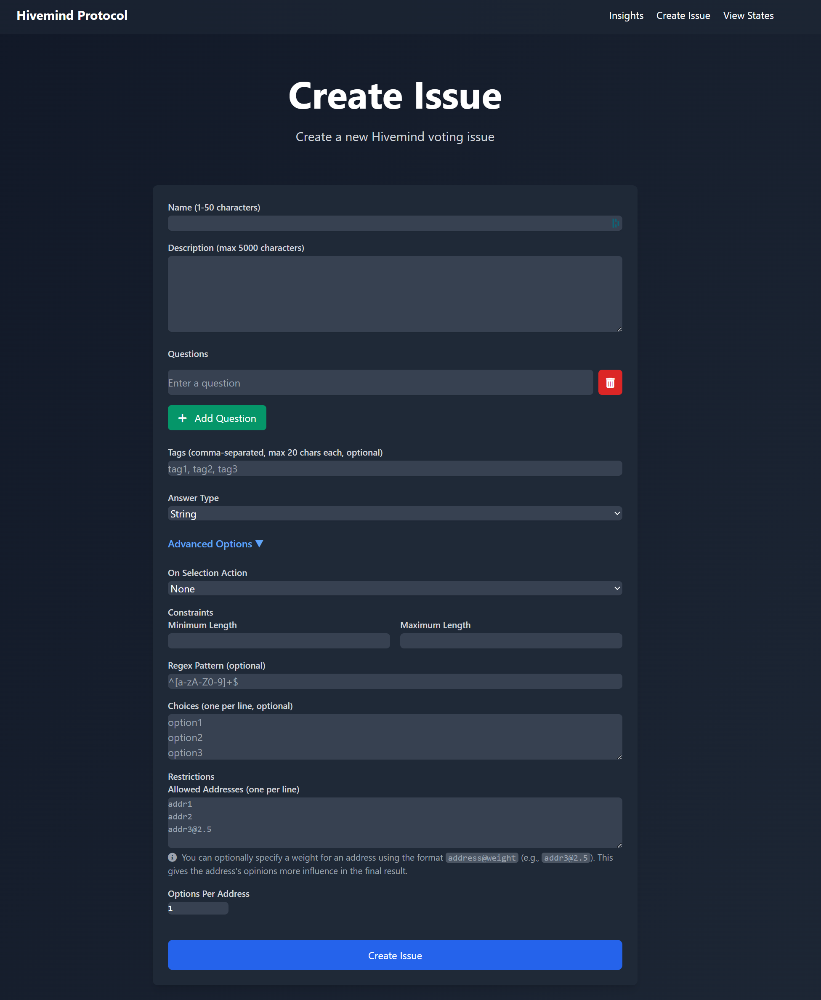
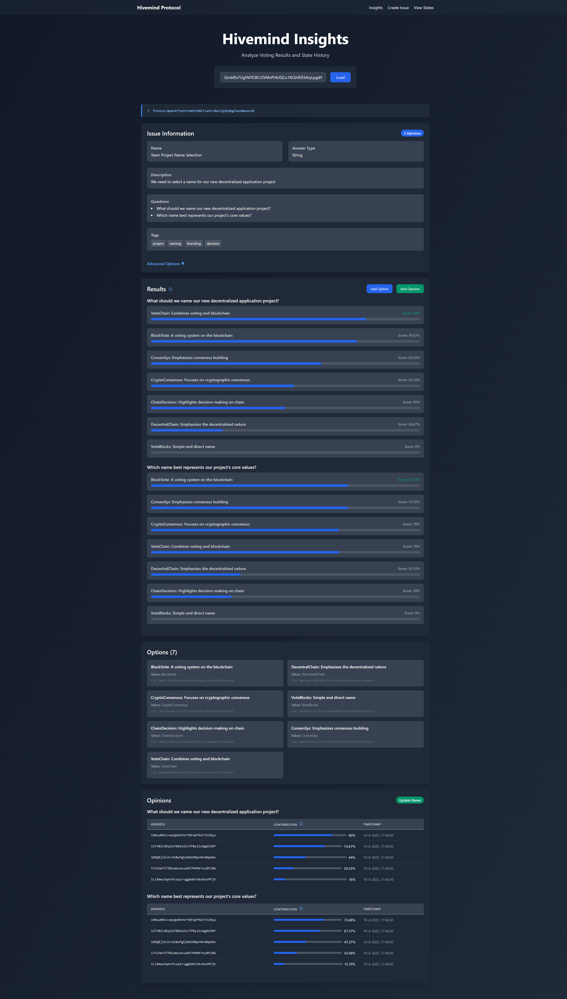
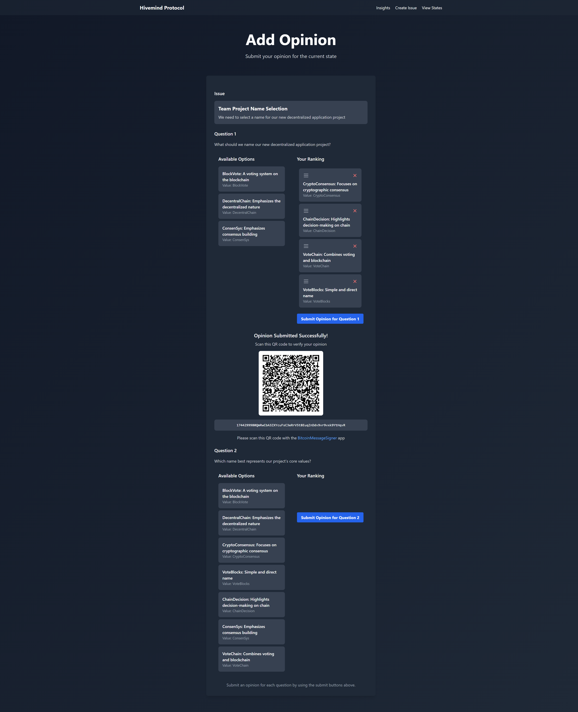
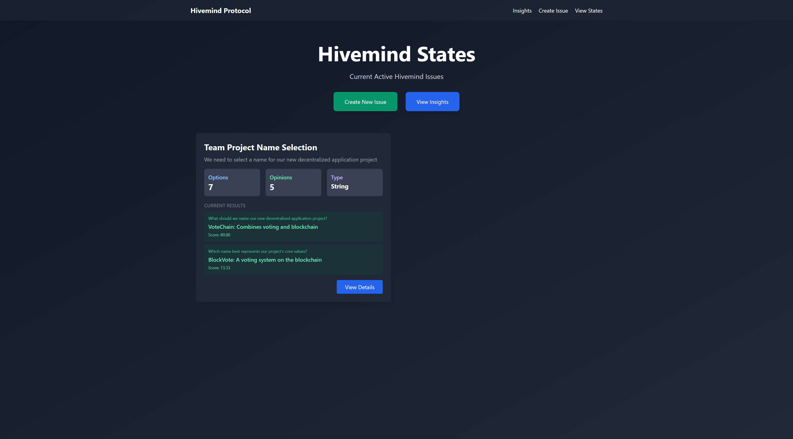

# Hivemind Web Application

This directory contains a web application implementation of the Hivemind Protocol, providing a user-friendly interface for creating and participating in decentralized decision-making processes.

## Overview

The Hivemind web application allows users to:
- Create new hivemind issues with customizable questions and constraints
- Submit options for consideration
- Vote on options using various ranking methods
- View real-time results and consensus
- Participate in a fully decentralized decision-making process

## Quick Start

### Docker (Recommended)

The Hivemind Protocol web application is available as a Docker image:

```bash
# Pull the Docker image
docker pull valyriantech/hivemind:latest

# Run the container with required ports
docker run -p 5001:5001 -p 8000:8000 -p 8080:8080 valyriantech/hivemind:latest
```

The web application will be accessible at http://localhost:8000

### Manual Setup

To run the web application without Docker:

```bash
cd hivemind
pip install -r requirements.txt
python app.py
```

The application will be available at http://localhost:8000 by default.

## Screenshots

### Landing Page

*The landing page showcases the key features of the Hivemind Protocol: Decentralized Storage, Bitcoin-Signed Messages, and Condorcet Voting.*

### Create Issue Page

*Users can create new issues with customizable parameters including name, description, questions, tags, answer type, and various constraints.*

### Insights Page

*The insights page displays comprehensive results and statistics for a hivemind issue, including rankings, scores, and participant information.*

### Add Opinion Page

*Participants can submit their opinions by ranking available options and signing their submissions cryptographically.*

### States Page

*The states page shows all active hivemind issues with their current status and results.*

## Architecture

The application is built with:
- FastAPI for the backend API and WebSocket support
- Jinja2 templates for server-side rendering
- JavaScript for interactive frontend features
- IPFS for decentralized data storage
- Bitcoin message signing for cryptographic verification

## Key Features

### Decentralized Storage
All voting data is stored securely on IPFS, ensuring transparency and immutability.

### Bitcoin-Signed Messages
Secure verification through cryptographic signatures using Bitcoin's proven security.

### Condorcet Voting
Advanced ranked choice voting system that finds the true consensus winner.

## Dependencies

### BitcoinMessageSigner

The web application requires [BitcoinMessageSigner](https://github.com/ValyrianTech/BitcoinMessageSigner) for cryptographic verification of user actions. This mobile application allows users to:

- Scan QR codes displayed in the web interface
- Sign opinions (votes) using Bitcoin's message signing capabilities
- Sign when submitting new options
- Sign when updating participant names
- Sign when selecting consensus outcomes

All actions in the Hivemind Protocol are authenticated and verified through these cryptographic signatures, ensuring the integrity and security of the decision-making process.

## Directory Structure

- `app.py`: Main application entry point and API routes
- `websocket_handlers.py`: WebSocket implementation for real-time updates
- `templates/`: Jinja2 HTML templates
- `static/`: Static assets (CSS, JavaScript, images)
- `states/`: Directory for storing hivemind state files
- `data/`: Directory for additional data files
- `logs/`: Application logs

## Usage

1. Access the web interface in your browser
2. Create a new hivemind issue or join an existing one
3. Install the BitcoinMessageSigner app on your mobile device
4. Scan QR codes to sign your actions
5. Participate in the decision-making process
6. View real-time results and consensus

## Example Use Cases

- Team decision-making for project names, features, or priorities
- Community governance and voting
- Decentralized autonomous organizations (DAOs)
- Consensus-building for complex decisions
- Preference aggregation for group choices

## Technical Implementation

The Hivemind Protocol implements the Condorcet method for determining consensus, which:
- Compares options in pairwise matchups
- Identifies the option that would win against all others in head-to-head comparisons
- Handles cycles and edge cases through sophisticated ranking algorithms
- Provides fair and representative results even with diverse preferences

## Contributing

Contributions to the Hivemind Protocol are welcome. Please feel free to submit issues and pull requests to improve the application.

## Brought to you by
[Valyrian Tech](https://linktr.ee/ValyrianTech)
